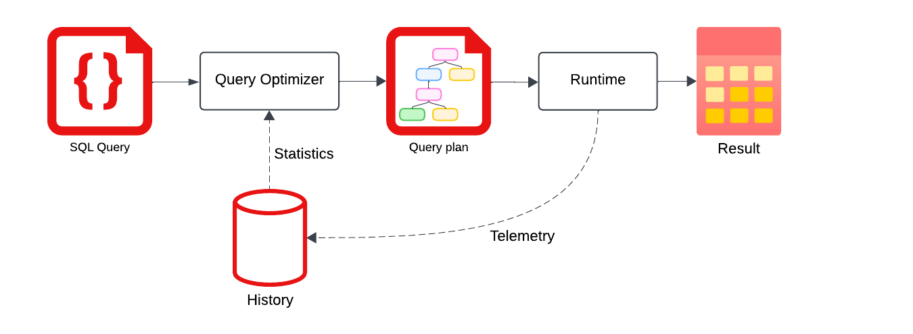

## Overview

Firebolt's query plans adapt and evolve with your workload over time.
Through a feedback loop, Firebolt's query optimizer learns from previous queries and progressively generates more efficient plans, steadily improving query performance towards optimal runtimes.

**Topics**
* [Scope of history-based optimization](#scope-of-history-based-optimization) &ndash; Learn which processes utilize history-based optimization.
* [How it works](#how-it-works) &ndash; Learn how telemetry data and query history help optimize future query plans and performance.
  * [How recording query history works](#how-recording-query-history-works) &ndash; Learn what is recorded in query history and how information is protected.
  * [How planning queries based on history work](#how-planning-queries-based-on-history-work) &ndash; Learn how history-based snapshots are continually updated to improve query performance across all engines in the same database and account.
* [Observability](#observability) &ndash; Learn how to check if history-based optimization is used in your query plan.

## Scope of history-based optimization
Firebolt's history-based optimization techniques include the following:
- **Join ordering** ---
  The sequence in which tables are joined during query processing, especially in complex queries with multiple tables, can significantly affect query performance.
  Firebolt uses query statistics and historical patterns to determine the most efficient join order that optimizes both run times and resource utilization.
- **Aggregating index selection** ---
  Firebolt analyzes historical query patterns to identify the most frequently used aggregating indexes, which store pre-computed aggregates such as `SUM`, `AVG`, and `COUNT`.
  It then suggests indexes to reduce computational load during query processing.
- **Semi-join and anti-join planning** ---
  Firebolt's query planner selects the most efficient way to run semi-joins, which return matching rows, and anti-joins, which return rows with no match in another table.
- **Broadcast and shuffle strategies for multi-node engines** ---
  Firebolt uses a broadcast strategy for small datasets that can be efficiently distributed across all nodes to minimize data movement, and a shuffle strategy when both datasets are large.
  Implementing these strategies can greatly improve query performance for distributed joins by optimizing how data is distributed and processed across multiple nodes.

## How it works

When you run a query, Firebolt's query optimizer constructs a query plan to run the process efficiently.
After running the query, the collected telemetry is fed back into Firebolt's history snapshot.
When you run the next query, the query optimizer accesses the telemetry that was collected in that history snapshot and extracts from it statistical information.
Consequently, previously run queries aid the query optimizer in finding better query plans for subsequent queries and thereby improve performance.



### How recording query history works

Firebolt’s query optimizer improves runtime performance by automatically collecting and analyzing telemetry data from past queries, without requiring user intervention.

Only the query plan and its related telemetry data are stored in the history snapshot. This telemetry includes metrics for each query operator, such as the number of rows and bytes processed, time elapsed, and memory usage. The query plan itself retains the original query string, meaning if the query contains personally identifiable information (PII), it will appear in the snapshot. However, the query result is not used in optimization, so PII in the result is not stored. While PII in the query string is stored, the history snapshot is securely protected. Access is restricted to engines on the same database and account, as well as to authorized Firebolt personnel only.

### How planning queries based on history work

When you submit a query, Firebolt analyzes its recorded history to predict how different query plans will perform, and chooses one that should deliver the best performance.
This query history is released to the query optimizer every `10` minutes in the form of a history-based statistics (HBS) snapshot.

Each engine has a dedicated HBS component that is always active, continuously generating snapshots for the engine to reference during query planning.
These snapshots are saved and shared among all engines running on the same database within the same account.
Consequently, an engine can benefit from the query history from another engine, improving performance across all engines without needing to restart the analysis process.
After engine restart, the engine retrieves the latest HBS snapshot.

## Observability

The Firebolt query optimizer uses HBS in the scenarios listed in the scope section above.
To see whether history-based statistics were used when planning your query, use `EXPLAIN` with the `statistics` option, as follows:

```sql
EXPLAIN (statistics)
select ...  -- your query goes here
```

The `EXPLAIN` option `statistics` annotates all nodes of the query plan with the sources of statistics used in its cost estimation.
An example of the `EXPLAIN (statistics)` output below shows `source: history`, and we know that the estimates were made based on history.

```plain
[Logical Profile]: [source: history]
```

For more information about output from `EXPLAIN (statistics)`, including various possible values that the source field can take, see [Explain: Example with statistics](../../sql_reference/commands/queries/explain.html#example-with-statistics).

The `EXPLAIN(statistics)` output will not show `source:history` during the first run of an alternate query plan if the optimizer finds that the initial query plan was not optimal. This absence occurs because the alternative plan has not yet gathered telemetry data during its initial run.
In the next execution of the same query, the optimizer understands that it should choose an alternative plan to avoid the slow execution.
This means, that history-based statistics are in effect, but we may not see `history` shown in sources of the `EXPLAIN (statistics)` output for the new run.
It could be that for the alternative plan we have not collected its execution telemetry yet.
